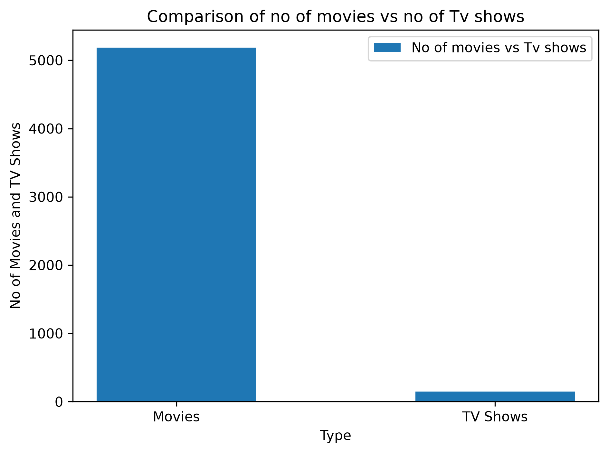
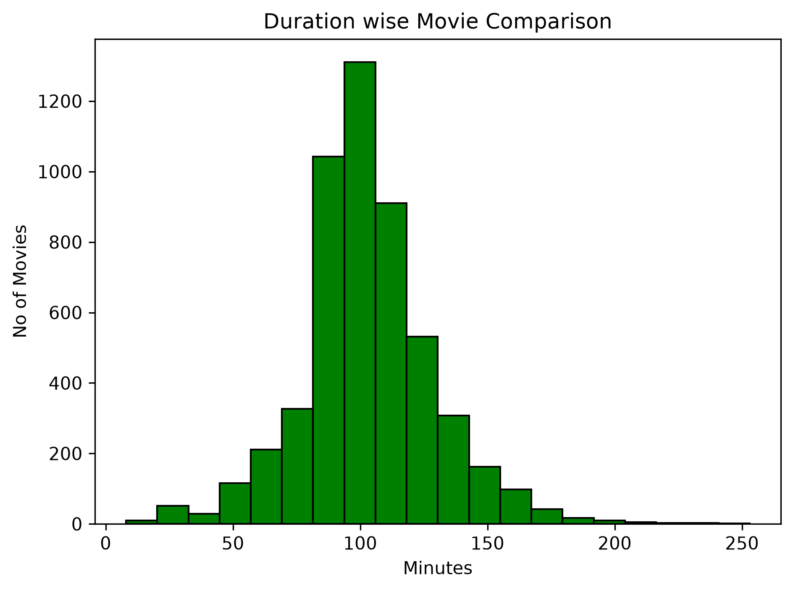
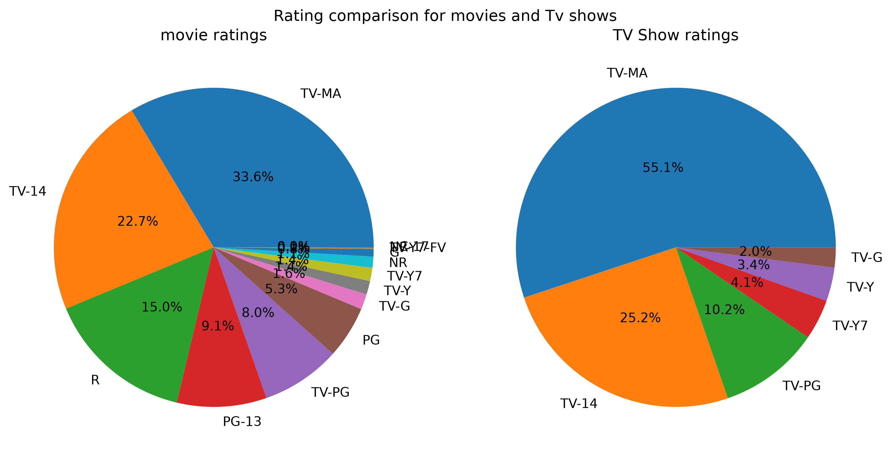
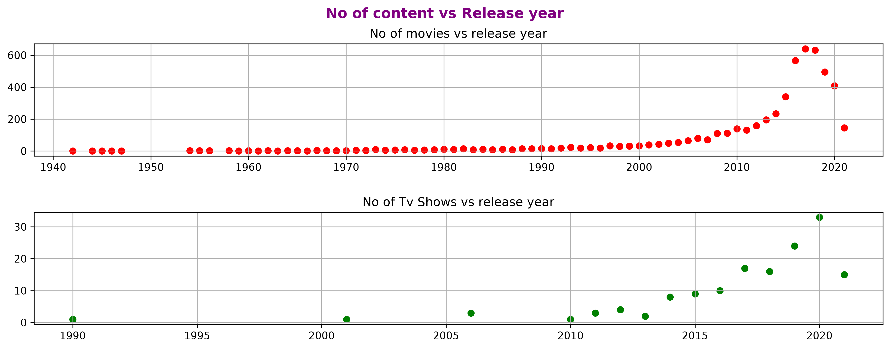
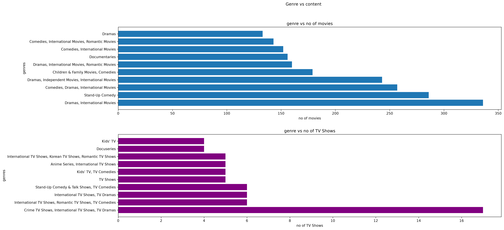
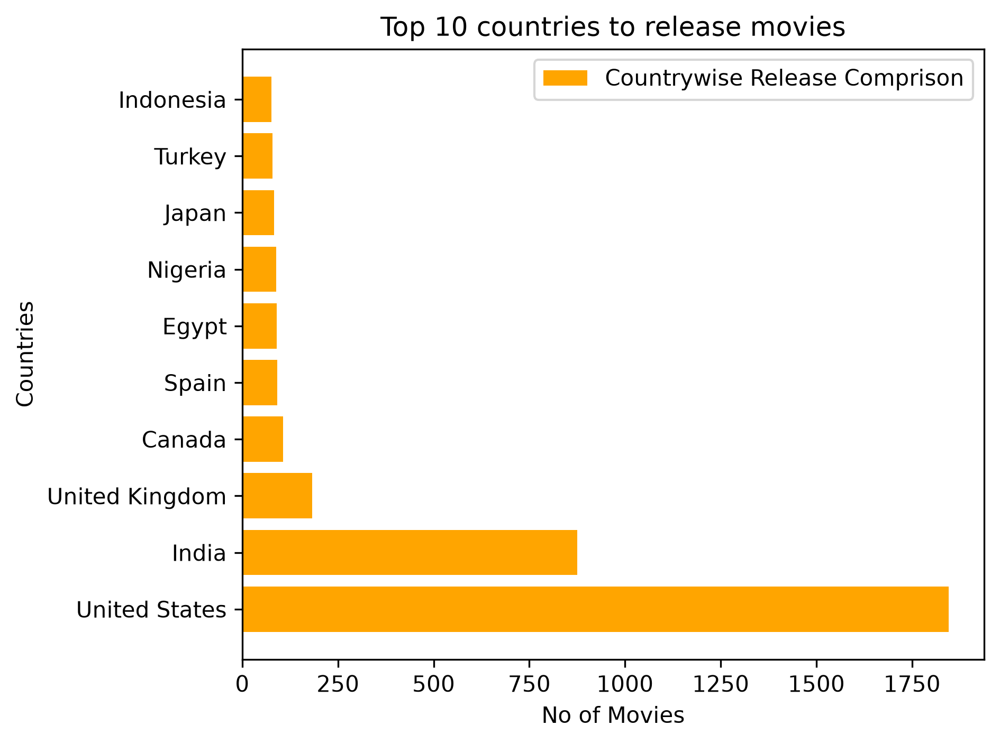

# 🎬 Netflix Data Analysis

## 📌 Project Overview

This project analyzes the Netflix Movies and TV Shows dataset using Python. The analysis focuses on data cleaning, exploratory data analysis (EDA), and visualization to discover trends in Netflix content.

---

## 📂 Dataset

- Dataset: Netflix Movies and TV Shows
- Format: CSV
- Records: 8807
- Source: Kaggle

---

## 🛠 Technologies Used

- Python
- Pandas
- NumPy
- Matplotlib
- Jupyter Notebook
- Git & GitHub

---

## 🧹 Data Cleaning

- Removed missing values
- Checked duplicate records
- Cleaned duration column
- Converted data types where required

---

## 📊 Analysis Performed

- Movies vs TV Shows
- Content ratings
- Distribution of movie durations
- Top countries producing Netflix content
- Release year analysis
- Most common genres

---

## 📈 Visualizations

### Movies vs TV Shows



### Movie Duration Distribution



### Ratings Distribution



### Yearwise Content Release



### Most Common Genre



### Top 10 Countries Releasing Netflix Content



---

## 🔍 Key Insights

- Movies make up the majority of Netflix titles.
- TV-MA is the most common content rating.
- Most movies are between 80 and 120 minutes long.
- The United States has the highest number of Netflix titles.

---

## ▶️ How to Run

1. Clone the repository

```bash
git clone <your-repository-url>
```

2. Install dependencies

```bash
pip install -r requirements.txt
```

3. Open the notebook

```bash
jupyter notebook
```

---

## 👨‍💻 Author

Ayushman Roy
